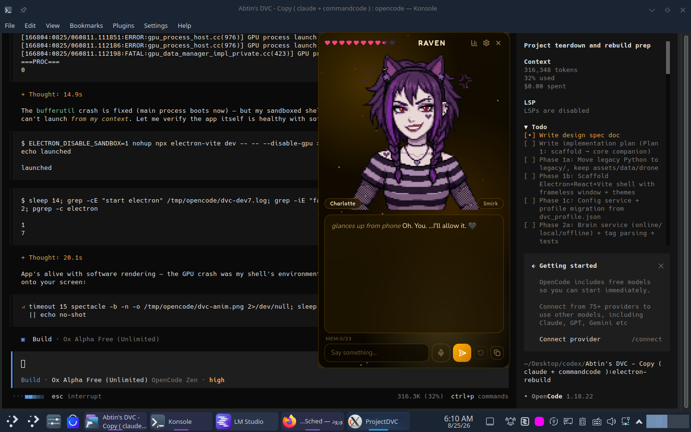

# 🌙 ProjectDVC — Desktop Virtual Companion

<p align="center">
  
</p>

**ProjectDVC** is an always-on-top desktop AI companion built on **Electron + React**.
She lives on your screen — chatting with a typewriter bubble, swapping pixel-art
sprites across 19 emotions, lip-syncing while she speaks, remembering you across
sessions, and optionally joining your Minecraft world as a fully autonomous bot.

> The architecture, character concepts, and creative direction are **Abtin's**.
> AI tools assisted as a very fast pair programmer.

---

## ✨ Features

### 🧠 Companion Brain
- **Three brain modes** — Local (LM Studio / Ollama), Online (any OpenAI-compatible API), Offline (rule-based, zero network)
- **Enforced emotion format** — every reply carries an `[EMOTION:]` tag driving her face; weighted keyword detection as fallback
- **21 personas** — Goth Baddie, Vampire, Gremlin, Maid That Hates You, Mean Girl, Friend, Mentor and more — each with custom greetings and persona-switch lines
- **3-tier memory** — permanent facts, session traits (auto-deduplicated, capped, compressed), and AI-summarized session recall ("Last time we talked about…")
- **RPG stats** — 10 live stats (Affection, Sass, Chaos…) that shift with how you treat her and color her personality
- **Reasoning-safe** — thinking-channel output from local models (GPT-oss style) is stripped automatically

### 🎨 Visuals
- **12 unified themes** — each palette brings its own matching background gradient
- **Custom gradient editor** — colors, angle, 5 gradient styles, presets
- **13 particle systems** — Stars, Embers, Snow, Bubbles, Sakura, Fireflies, Matrix, Rain, Hearts, Fireworks, Sparkles, Confetti, Constellation (proximity-linking dots)
- **Ambient animation** — aurora orbs + breathing portrait + emotion pop transitions + floating stat chips
- **Animation speed slider** (0.25×–3×) and **reduce-transparency** mode for low-end GPUs

### 🎙️ Voice
- **TTS chain with fallback** — ElevenLabs (18 emotion-tuned voice profiles) → edge-tts → Piper (offline)
- **Lip-sync** — sprite flips between talking/current emotion while audio plays; optional text-mode lip-sync
- **Microphone STT** — live VU meter, Groq Whisper transcription, auto-send

### ⛏️ Minecraft (optional)
- One-click drone connect — spawns the bundled Mineflayer bot
- **Console** (% commands), **Radar** (32-block entity scope), **Inventory** tracker
- Autonomous survival: auto-eat, auto-defend, respawn + item retrieval, mining, combat, following
- In-game `#chat` triggers her MC brain — she replies in character with her own face

### 🛠️ Quality of Life
- Tray icon with hide-to-tray · window position memory · always-on-top toggle
- UI sound effects (WebAudio-synthesized) · idle chatter · regenerate/copy reply
- Memory export/import · cheat codes (`rosebud`, `iddqd`, `forcehappy`…)
- Auto-saving appearance settings · setup wizard · factory reset

---

## 🚀 Install & Run

**Requirements:** [Node.js](https://nodejs.org) 20+ (no Python, no pip — just Node)

```bash
git clone https://github.com/OneEyeAbtin/ProjectDVC.git
cd ProjectDVC
npm install
npm run dev
```

> **Linux only:** if the window fails to launch with a sandbox error, run
> `ELECTRON_DISABLE_SANDBOX=1 npm run dev` (or fix the SUID sandbox binary).

First launch opens a **20-question setup wizard** — then she's yours.

**Configure a brain:** Settings → AI/API → point at LM Studio / Ollama / any
OpenAI-compatible endpoint, or paste a cloud API key. No key? Switch brain mode
to **Offline** and she still talks.

**Voice:** Settings → Voice → enable → pick an engine (Edge = free, no key) → Test.

**Minecraft:** Settings → ⛏ MC → server details → ⛏ button in the top bar.

---

## 🧪 Development

```bash
npm test                    # 461 unit tests (vitest)
npx electron-vite build     # production build to out/
```

```
src/main/       Electron main process — services (config, memory, brain,
                voice, characters, window, minecraft), IPC contract, providers
src/preload/    Secure contextBridge (channel allowlist)
src/renderer/   React UI — chat, emotions, settings, ambient FX
drone/          Mineflayer Minecraft bot (Node, independent)
assets/         Sprites, sounds, Piper voices
docs/           Design specs, implementation plans, audit reports
```

## 📜 License

Copyright (c) 2026 **Abtin** (github.com/OneEyeAbtin). All rights reserved.
Proprietary and confidential — may not be copied, modified, distributed, or used
without explicit permission from the author.
